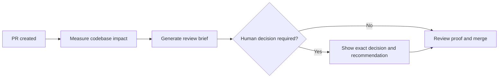

# Low-Burden Response Patterns

Use these as shape examples, not rigid templates. Preserve exact proof, risk,
commands, paths, and safety context from the real task.

## 1. Simple Outcome: Use Plain Language

Use:

> The sync completed. All three global skill copies match the repository. No
> response is needed.

Avoid a status table or workflow diagram. There is only one outcome.

## 2. Soft Preference: Recommend and Continue

Use:

> I’ll keep the generated report local by default because publishing it would
> create a public URL. If you want it published later, I can handle that.

This is not a blocking question. The default is safe and reversible.

## 3. Hard Decision: Keep the Ask Together

Use:

> **Need from you — hard stop**
>
> Approve the production deployment?
>
> **Why you:** It changes the live service and only you can authorize that.
> **Blocked:** Production rollout.
> **Recommendation:** Approve after reviewing the linked staging proof.

Do not bury the question after implementation history or offer several
agent-owned alternatives.

## 4. Repeated Fields: Use a Table

Use:

| Option | Cost | Risk | Recommendation |
|---|---:|---|---|
| Open locally | None | Low | Default |
| Download from GitHub | None | Low | Good for sharing |
| GitHub Pages | Check current repository plan | Public URL | Use only when publishing is wanted |

Avoid three paragraphs that repeat the same labels. Skip the table if there are
only one or two facts with no useful comparison.

## 5. Workflow or Dependency: Use One Diagram

Use when order and branching matter:

Follow it with only the decision or caveat the diagram cannot carry. Do not
repeat every edge in prose.

## 6. Active Work: Rank by User Impact

Use:

> The login path is fixed; account export is still blocked.
>
> 1. **Login:** verified through the browser.
> 2. **Account export:** blocked by a missing production credential.
> 3. **Internal cleanup:** complete; no review needed.

Order by effect on the person or application, not by the order files were
edited.

## Quick Test

Before sending:

1. Can the reader find the outcome or required action in five seconds?
2. Does every question truly belong to the reader?
3. Does the chosen format reveal a relationship that prose would make them
   reconstruct?
4. Can any sentence, row, or node disappear without losing action, truth, proof,
   risk, or safety?
