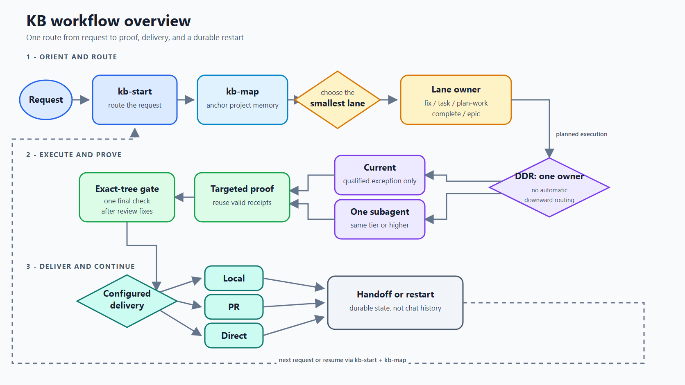
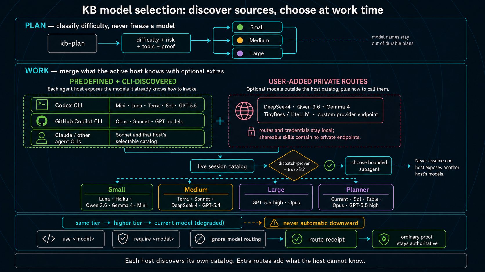
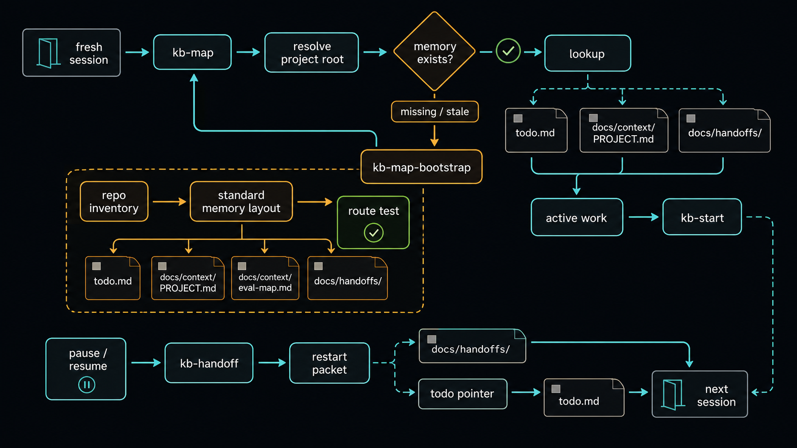

# Working Skill Repo

Portable KB workflow skills for GitHub Copilot and Codex.

Status: actively used, pre-1.0. Expect churn while the marketplace, eval, and
pipeline maintenance pieces settle.

This standalone bundle grew from ideas in the original All-The-Vibes ATV
StarterKit and CE review/learning workflow. KB now owns the copied and adapted
skills here: voice-friendly routing, project memory, fresh-session handoff,
proportional planning, reviewer agents, and execution gates. No ATV checkout is
an install, sync, release, or delivery dependency.

Most users only need the runtime skills. You do not need Go, the eval harness,
or the marketplace machinery to use the workflow in your own repo.

## Graph-Compatible Workflow Milestones

| Graph criterion | What went in | Date / commit |
|---|---|---|
| **Bounded nodes** | Independently executable vertical slices with acceptance criteria and expected files | **May 23, 2026** — `bb890f8` |
| **Explicit edges** | `blockers` relationships between slices, plus missing-edge and cycle validation | **May 23, 2026** — `bb890f8` |
| **Graph traversal** | `kb-work` selected runnable slices in dependency/topological order | **May 23, 2026** — `bb890f8` |
| **Fan-out** | All safe, independent ready nodes could dispatch concurrently | **June 1, 2026** — `0be21ab` |
| **Barriers/fan-in** | Dependent nodes waited for all blockers; serial, HITL, and shared-resource nodes formed barriers | **June 1, 2026** — `0be21ab` |
| **Independent consolidation graph** | Parallel persona reviews merged and deduplicated into one result | Origin **May 23, 2026**; dedicated `kb-review` **May 28, 2026** — `e40166c` |
| **Code-enforced scheduler** | Ready-set and cycle rules moved from skill prose into deterministic Go checks | **June 2, 2026** — `2fb60fd` |
| **Outer loop over graphs** | Durable `kb-goal` repeatedly routed work units through planning and graph execution until terminal | **June 8, 2026** — `cbcda0f` |

The workflow combines a durable outer loop with dependency-ordered work graphs.
See the
[research note](docs/context/research/2026-07-29-graph-engineering-definition-and-provenance.md)
for terminology and prior art.

## Start Here

Clone this repo, install the skills, then ask `kb-start` to route your first
task from inside a project:

```shell
git clone https://github.com/Irtechie/working-skill-repo.git
cd working-skill-repo
npx github:Irtechie/working-skill-repo --target all --profile core
cd <your-project>
kb-start "what I want done"
```

`kb-start` is a skill invocation through Codex, Copilot/GHCP, or another agent
that has this bundle installed. It is not a standalone shell binary.

The core loop is six skills:

| Skill | Job |
| --- | --- |
| `kb-start` | Pick the smallest correct lane for the request |
| `kb-map` | Build or read repo-local memory so fresh sessions recover quickly |
| `kb-fix` | Handle narrow bugs and small contained edits |
| `kb-plan` | Review the full requirements once, then create vertical slices with verification |
| `kb-work` | Execute ready slices with narrow proof and batch shared checks |
| `kb-complete` | Take a feature, plan, or manifest to its configured local, PR, or direct endpoint |

Everything else is an internal phase, compatibility alias, or optional depth.

### Current proportional lifecycle

The default path is single-agent-first and plan-wide rather than reviewer-heavy:

1. Requirements receive a main-agent self-check; `document-review` runs only
   for a material unresolved uncertainty.
2. Slices run narrow deterministic proof, then one integrated aggregate.
3. `kb-review` runs one broad profile or one replacement specialist after the
   integrated tree is ready, never a reviewer swarm per slice.
4. Final exact-tree proof runs after code-affecting review fixes.
5. `ce-compound`, `learn`, `evolve`, and memory maintenance run only when their
   evidence signals are present.

Planning classifies each slice's minimum execution capability as `small`,
`medium`, or `large`; deterministic route-complexity fixtures protect that
rubric. Work-time DDR resolves one actually callable same-tier-or-higher route
without writing provider or model names into durable plans.

Manifest worktrees and their plan-run branches share one short, task-relevant,
irreverent-but-work-safe codename, such as worktree
`the-reviewers-have-unionized` with branch
`codex/the-reviewers-have-unionized`, not opaque random adjective-noun pairs.

### One owner, one useful proof wave

Before mutation, `kb-start` writes a repository-wide work claim under the Git
common directory. Every worktree sees the same work ID, project session ID,
branch, worktree, status, and heartbeat. A second session reports the active
owner instead of repeating discovery, implementation, or tests. The default is
one owner per work ID and at most three distinct active owners per repository.
Claims declare normalized semantic resources such as `publisher:<product>`,
`release-manifest:<product>`, and `deploy:<environment>`; conflicting active
local writers fail closed while disjoint resources remain runnable.

The standalone `kbreconcile` CLI performs portfolio `dry-run`, `plan`, `apply`,
and `verify`, including repositories without KB files. Its
`claim-capability --json` and `claim-conformance --json` surfaces expose the
provider-neutral CAS/fencing contract without pretending a live adapter exists.
Protected writers require authoritative canonical claims, scoped verified
authority, endpoint high-water fencing, durable idempotency, and proven
gateway-only IAM/network paths. Git-common-directory queue and lease state is
local coordination, never global authority.

Lifecycle completion is independent across delivery, physical cleanup, ref
retirement, and host session retirement. `local-durable`, `awaiting-review`, and
`delivery-integrated` are registered before ownership release. An open PR may
remain awaiting review without consuming active WIP; its refs and exact resume
packet remain even when a later controller retires a proven-clean worktree.

Verification is mandatory but not replayed at every workflow phase:

1. Each slice runs its narrowest deterministic proof after its code stabilizes.
2. A coherent group of dependent slices runs shared integration, functional,
   and regression checks once at its proof-batch boundary.
3. Review fixes invalidate only affected receipts.
4. The final delivery tree runs one exact-tree aggregate.
5. Finalize and ship reuse that receipt while the tree, check inputs, and
   environment identity remain unchanged.

Protected oracles and auth, secrets, destructive data, public-contract, and
live/deploy boundaries still receive immediate targeted checks. They do not
justify replaying unrelated suites.

## Learning Wiki

The generated [KB Learning Wiki](docs/learning-wiki/index.html) turns the
repository's scoped instincts, compounded solutions, goal ledgers, and research
into one searchable human view. It is a read-only projection: edit the linked
YAML or Markdown source, then regenerate it with:

```shell
npm run wiki:build
```

This preserves the learning model's narrow-scope and promotion rules instead of
creating a second manually maintained knowledge store.

## UniversalUI Skills Contribution

This repository owns the canonical Skills catalog under
`.github/skills/*/SKILL.md`. The installer packages that tree, and the
UniversalUI contribution at `packages/universal-ui-skills-contribution`
projects its stable frontmatter identity into one host-owned React route:

| Field | Value |
| --- | --- |
| Package | `@irtechie/universal-ui-skills-contribution` |
| Contribution | `io.irtechie.working-skill-repo.skills` |
| Stable route | `/apps/skills` |
| Legacy input | `/?tab=skills` |
| Contract | `universal_ui.contribution.v1`, host `^0.1.0` |

The projection includes only each skill's repo-relative identity, description,
argument hint, category, and public source URL. Skill Markdown bodies are not
shipped in the catalog. React renders every projected value as text; the
contribution has no raw-HTML renderer, executable Markdown, shell, router,
global frame, or machine-private source path.

Build the catalog, test the package, and create its release artifact:

```shell
npm run catalog:build --prefix packages/universal-ui-skills-contribution
npm run test:universal-ui-skills
npm run pack:universal-ui-skills
```

The optional rendered smoke fixture uses React and Vite from a local
UniversalUI checkout without adding them as contribution-owned dependencies.
Set `UNIVERSAL_UI_ROOT` to that checkout, start Vite with
`packages/universal-ui-skills-contribution/test/browser-fixture` as its root,
then open the printed local URL with `agent-browser`.

The pack command writes the tarball and
`release/universal-ui.release-lock.json` under the contribution package. The
release lock binds `contributionDefinition` to the tarball SHA-256.

UniversalUI should install the tarball with scripts disabled, import
`contributionDefinition` and `routeLoaders`, import the package's
`styles.css`, and merge them into its existing active-set preflight and
host-owned router. The lazy `skills` route component accepts
`{ context: ShellContextV1 }`; it does not mount React or create a shell.
The current UniversalUI fleet test contribution also registers `skills`, so
the host must remove that synthetic route before activating this canonical
owner package or active-set collision preflight will reject the release.

The private `@irtechie/universal-ui-contract` package is not a registry,
workspace, or source-alias dependency. To optionally prove conformance against
an immutable local contract tarball:

```powershell
$env:UNIVERSAL_UI_CONTRACT_TGZ = "<immutable-contract-tarball>"
$env:UNIVERSAL_UI_CONTRACT_SHA256 = "<expected-sha256>"
npm run verify:universal-ui-contract
```

On macOS or Linux:

```shell
export UNIVERSAL_UI_CONTRACT_TGZ="<immutable-contract-tarball>"
export UNIVERSAL_UI_CONTRACT_SHA256="<expected-sha256>"
npm run verify:universal-ui-contract
```

The verifier runs an offline, `--ignore-scripts` install, checks package name
and version, then validates the local contribution through the installed
contract's public export.

Optional `kb-configure` writes portable per-project execution policy. Most users
never need it. Orchestrator-directed DDR is the default: the current
orchestrator either retains a slice or delegates it once to one qualified
same-tier-or-higher worker. Optional user-local `kb-models` state saves
`automatic`, `self-hosted-first`, or `native-first` source preference without
configuring model-by-model plan mappings.

For one state-aware plan-to-endpoint run, use:

```text
kb-complete <feature-or-plan-or-manifest>
```

It recovers the current phase, runs planning, work, and finalization as needed,
then applies project delivery policy: PR by default, or local-only, or
explicitly authorized direct integration and post-integration sync.

Delivery defaults to `mode: pr` with `merge: manual`. Finished work is
committed, pushed, and opened as a review-ready PR without asking, then
`kb-complete` asks once whether to sync now or wait for PR review. Reaching
PR-ready is automatic; accepting a PR never is. Projects that want work to stay
on disk opt out with `kb-configure delivery-local`.

For long-lived objectives that may run across days or sessions, use `kb-goal`.
It keeps the durable objective and terminal proof ledger, then routes each work
unit through the normal KB lanes. `kb-complete` is one state-aware completion
run; `kb-goal` can run many runs or smaller lanes until the larger goal is
complete or honestly blocked. Under a goal, brainstorming is low-interruption:
the agent picks the best path from evidence and asks only for true planning
blockers.

Pause and stop are preemptive controls, not steering suggestions. `pause`,
`stop`, `cancel`, or `end` interrupts goal work immediately, then asks whether
to end the goal or keep it paused. No dispatch, polling, cleanup, or state
maintenance continues while awaiting that answer. A confirmed end parks the
ledger without claiming completion and prints the exact `/kb-goal <objective>`
command needed to resume it.
No sibling, child, or coordinator may override the parent freeze; queued or
late successor work is rejected.

For recurring or trend-improvement goals, `kb-goal` can also record a live
steering loop: set point, sensor, controller, actuator, scope gate, batch size,
WIP bound, dampener, and steering memory. This is optional. It helps repeated
runs learn from durable feedback without replacing `kb-finalize`, `learn`, or
`evolve`.

The default installer profile is the runtime dependency closure. `core`
installs every runtime skill plus the baseline review/document agents needed by
the normal KB loop. `full` installs the same skills plus every
reviewer/specialist agent. The Go gate and marketplace are maintainer tools;
they are not required to start using the workflow.

The installer also attempts optional managed `kbrouter` and `kbreconcile`
artifacts under `~/.kb/bin`. Missing artifacts preserve the skill-only install.
Managed binaries are checksum-pinned, drift-safe, and backed up on authorized
replacement. No signed `kbreconcile` provenance source or live provider adapter
is published by this repo today, so an installed binary remains source/dev and
inventory capable but reports protected-writer capability unavailable.

## What This Repo Contains

This repo is two things:

1. A portable KB runtime bundle that teaches an agent how to recover local
   project memory, route work by shape, execute vertical slices, test its own
   changes, review the result, and leave durable handoff/context files behind.
2. A development harness that tests whether the bundle, routes, sync targets,
   eval fixtures, marketplace rules, and release gates still match the claims.

## Routing: Request, Execution, And Continuity

The workflow overview and two supporting diagrams describe one routing system:
`kb-start` chooses the work lane, DDR chooses the execution owner and capability
tier, and `kb-map` plus handoffs carry the route across sessions.

### KB Workflow Overview (Loop + Graph)



Every request enters through `kb-start`, which asks `kb-map` to anchor the work
to project memory before choosing the smallest fitting lane. Planned execution
uses DDR to select one qualified same-tier-or-higher subagent by default,
retaining current execution only through a qualified exception and never
routing downward automatically. Targeted proof is reused when still valid, one
exact-tree gate checks the final promotion candidate after review fixes, and
configured delivery stops at an open PR by default, or at local completion or
direct integration when explicitly configured. Handoffs and restarts return
through `kb-start` and `kb-map`.

### Request Routing With `kb-start`

`kb-start` applies these routes in priority order. It calls `kb-map` first; the
first row fires when that map is missing, partial, stale, or rooted in the wrong
project. This table is the human reference; the current
`.github/skills/kb-start/SKILL.md` contract remains authoritative.

| Request Signal | Route | Proof or Exit |
| --- | --- | --- |
| Memory missing, partial, stale, or rooted in the wrong project | `kb-map` | Project-local map is ready |
| Durable objective across days or sessions | `kb-goal` | Goal ledger plus terminal proof |
| One bounded task that should continue until verified or blocked | `kb-task` | Task-owned verification |
| Explanation or tradeoff discussion with no file change | Direct answer; use `kb-first-principles` behavior when challenged | No work gate |
| Feature, plan, or manifest should reach its configured endpoint | `kb-complete` | Planning, work, finalization, then configured delivery |
| Valid manifest is ready to execute; a commit-required plan-run manifest also has explicit local check-in authority | `kb-work` | Per-slice proof and scope gates; without check-in authority the run stops before mutation |
| Runnable slices are done; review, learning, and cleanup remain | `kb-finalize` | Completion gate |
| Broken behavior needs reproduction and iterative repair | `kb-troubleshoot` | Reproduction plus regression proof |
| Architecture needs deeper boundaries or simpler test seams | `kb-architecture-deepening` | Evidence-backed tradeoff |
| Committed code has accumulated duplication, wrong abstractions, or dead surface | `kb-simplify` | Up to six ranked targets, executed one at a time |
| External docs, prior art, or framework behavior may change direction | `kb-research` | Cited note |
| Large migration, rewrite, or multiple independent workstreams | `kb-epic` | Multiple requirements/manifests before work |
| Skills, scripts, evals, or proof surfaces must change together | `kb-epic` or a coded pipeline manifest | Cross-surface proof before integration |
| Clear feature or refactor needs vertical slices | `kb-plan` | Valid manifest and slice plans |
| Skill-bundle change has sync, docs, eval, or standards implications | `kb-plan` | Contributor checks plus release/sync drift report when propagation is authorized |
| Fuzzy idea or high-path-dependency product direction | `kb-brainstorm` | Planning questions resolved |
| Small known bug, typo, or narrow contained edit | `kb-fix` | Targeted proof |
| Memory, docs, or output are too hard to scan | `kb-compact` | Technical truth preserved with lower reading burden |
| Full idea-to-endpoint completion request | `kb-complete` | Same state-aware completion gates |

Handoffs re-enter through `kb-start` and `kb-map`; durable goals route each work
unit back through these same lanes.

### Planning And Execution Routing

KB separates three decisions that agents often blur together:

1. **Planning sets minimum capability.** `kb-plan` classifies each slice as
   small, medium, or large from difficulty, risk, required tools/context, and
   the proof needed to accept it. The plan does not freeze a model, provider,
   endpoint, transport, or source preference.
2. **The orchestrator chooses the owner once.** Immediately before a slice
   runs, `kb-work` decides whether its own reasoning, accumulated context,
   tools, trust, or authority require `current` execution. Otherwise it selects
   exactly one qualified same-tier-or-higher worker for `subagent` (delegated)
   execution.
   It never assumes another host's catalog, routes downward automatically, or
   silently falls back across owners.
3. **Proof accepts the result.** A routing receipt records what ran; it does not
   make the work correct. Tests, lint, browser assertions, API probes, or another
   objective check remain authoritative.

### Difficulty-Driven Routing (DDR)

DDR is the decision pattern; `kbrouter ddr attempt` reserves and runs one
bounded local attempt for an eligible configured user-local route. Attended
endpoint/auth approval is required only when the user opts into `required`
approval mode.
On a returned result, the parent runs deterministic proof and records the
verdict with `kbrouter ddr resolve`. Planning records required capability and
proof; execution records `current` or `delegated` ownership and chooses from
live evidence.

Immediately before execution, `kb-work` makes that choice visible:

```text
DDR route: <current|subagent> | primary: <current orchestrator|evidence-backed-route> | return: <none|parent-on-first-local-failure|required-alias-block> | tier: <small|medium|large> | proof: <short-proof-target>
```

The route line is the HITL (human-in-the-loop) first screen: owner, tier,
failure return, and proof target without the underlying policy dump. Its purpose is to
reduce human decisions, not reduce agent instructions. It never approves the
dispatch by itself; the named proof remains authoritative and must catch a bad
route or bad result.

Concrete route names come only from the active host or `kbrouter`, never model
memory. A preferred local route gets one eligible attempt. Probe, availability,
timeout, 5xx, dispatch, or deterministic-proof failure returns immediately to
the active parent; the parent continues with its own current/host-native
selection logic. No second local route is selected.

Two lightweight signals show whether this actually lowers human load:

| Signal | Measure | Desired Direction |
| --- | --- | --- |
| Decisions per slice | Count stops that require a human answer | Down; ordinary routing should require none |
| Time to orient at a checkpoint | Time from checkpoint arrival until the reviewer knows what happened and what they own | Down without weakening proof or oversight |

Neither signal is instrumented or gated today. They are observations for a few
representative runs, not harness output or a measured savings claim.



The model labels in the diagram are illustrative snapshots. They are not a
durable shared catalog. Routing reads the active host's exact callable-agent
schema and the live CLI/user-local catalog; it does not rely on a model's memory
of available model names. App-only aliases and CLI-only aliases remain distinct
unless an adapter proves them callable. Native App targets are invoked through
the App's exact delegation tool; CLI and user-local targets go through
`kbrouter`. Advanced users can add local or external OpenAI-compatible/LiteLLM
routes through user-local `kb-models` state, then save a project preference such
as `automatic`, `self-hosted-first`, or `native-first`. Credentials and private
endpoints never enter plans or shared skills.

Local route setup is explicit. Copy the placeholder, fill an ignored local
file, import it into canonical user-local state, choose no-prompt routing
(`disabled`, the default) or opt into attended approval (`required`), then let
work-time routing decide whether it is eligible. See
[LOCAL_MODELS.example.md](LOCAL_MODELS.example.md) for the full contract.

```powershell
Copy-Item config\kbrouter-routes.example.json kbrouter-routes.local.json
kbrouter models import --file kbrouter-routes.local.json
kbrouter models approval-mode --mode disabled  # bounded loops need no permission prompt
# Optional attended boundary:
kbrouter models approval-mode --mode required
kbrouter models approve --alias <filled-alias> --project-root <project-root>
kbrouter models doctor --project-root <project-root>
kbrouter models priority --project-root <project-root> --mode self-hosted-first
kbrouter models local-routing --enabled false  # preserve but bypass local routes
kbrouter models local-routing --enabled true   # resume local routes
```

### Enable Local Models And Size Their Work

Local routes remain configured when disabled. Turn them on globally, inspect
their health, and optionally prefer self-hosted routes for one project:

```powershell
kbrouter models local-routing --enabled true
kbrouter models doctor --project-root <project-root>
kbrouter models priority --project-root <project-root> --mode self-hosted-first
```

Turn them off without deleting aliases, endpoints, approvals, or project
preferences:

```powershell
kbrouter models local-routing --enabled false
```

Size each slice by the **minimum capability needed to complete and prove it**,
not by file count, estimated duration, or which model you hope will run it:

| Tier | Use when | Typical local-model fit |
|---|---|---|
| `small` | Bounded mechanical work, one clear subsystem, narrow context, deterministic proof | Fast coding model for focused edits, fixtures, or straightforward tests |
| `medium` | Several interacting files, non-trivial debugging, API/state reasoning, or broader test interpretation | General coding model with reliable repository reasoning and tool use |
| `large` | Cross-subsystem design, ambiguous failures, security/data risk, migration strategy, or long-context synthesis | Strongest available model; keep on the parent/host when no local route is proven capable |

The tier is a floor: `kbrouter` may choose a same-tier-or-higher eligible route,
never a weaker route merely because it is local. Deterministic proof—not the
tier or model name—decides whether the result is accepted.

For authenticated endpoints, store the token in an environment variable and put
only that variable's name in `auth_env`. Use `--probe` on `doctor` only for an
explicit live endpoint/model check.

Run-only controls remain explicit:

- `use <model>` prefers an eligible route for this run;
- `require <model>` hard-pins it or fails;
- `ignore model routing` explicitly chooses current execution;
- an eligible local route gets one attempt; failure returns to the active parent;
- the parent uses its active model or host-native selection logic without a
  runtime approval checkpoint or provider roulette.

### Memory And Handoff Routing



`kb-map` anchors every route to the active project. `kb-handoff` preserves the
minimum restart packet, and the next session returns through `kb-start` and
`kb-map` rather than relying on chat history. The concrete files and lifecycle
rules are listed under [Project Memory](#project-memory).

## What Makes This Different

- `kb-start` routes work instead of forcing every request through one heavy
  workflow.
- `kb-map` keeps repo-local memory so fresh sessions can recover without chat
  history.
- `kb-plan` decomposes clear work into vertical slices with verification
  contracts.
- `kb-work` executes manifest slices using ready-set and scope-lease rules.
- At execution time, the current orchestrator reasons first and records one
  owner: retain the slice or delegate to exactly one qualified worker. Durable
  plans contain tier/proof, never model or transport advice. Host-native routes
  come from and execute through the active callable schema. `kb-models`
  configures optional user-local OpenAI-compatible/LiteLLM extras for
  `kbrouter`; no generic MCP model dispatch is claimed.
  Ordinary work silently uses `automatic` when the project has no saved choice.
  Explicit setup may save `automatic`, `self-hosted-first`, or `native-first`.
  Connection details stay user-local, the receipt records
  what actually ran; only a route-bound receipt linked to proof establishes
  `dispatch-proven`, and only `require <model>` hard-pins.
- A plan tier is minimum execution capability, not the validator. Deterministic
  proof accepts the result.
- `kb-finalize` runs internal review, proof, follow-up cleanup, learning, and
  memory refresh.
- `kb-complete` is the single user-facing state-aware orchestrator through
  configured delivery.
- `kb-goal` can keep a human on long-running loops through concise steering
  memory that affects future runs.
- `cmd/kbcheck` is a maintainer gate for route fixtures, skill lint, eval
  scoring, marketplace firebreaks, sync drift, and release profiles.
- Material slices may carry vendor-neutral context packets so bounded workers
  receive exact files, prefetch, constraints, proof targets, search policy, and
  escalation triggers instead of rediscovering the repo.
- `kbcheck provider-hygiene` rejects Phoenix activation. `surface-report`
  separates base startup from conditional skill cost.

## Routing And Rework Control

The core purpose is to stop treating every request like the same kind of work.
The harness is designed to avoid rework by choosing the smallest lane that can
still prove the result. That is the claim this repo can defend today: the
routes, gates, and checks exist in code and skills. It does not claim measured
token savings.

Model selection follows the same split. `kb-plan` records the slice difficulty,
risk, tools, context, and proof without freezing a model name. `kb-work` reads
the active host's exact callable schema, then merges optional user-local
OpenAI-compatible/LiteLLM extras for delegated selection. Extra origin, hosting
class, and trust are independent: an extra may be self-hosted, provider-hosted,
or unknown. A planned tier is portable: any compatible CLI or host may map the
same slice to a different concrete model when it picks the plan up. The
selected model is runtime receipt data, not durable plan state. The
orchestrator scopes the work, sets its minimum tier, and
supervises proof; one qualified subagent normally executes each bounded slice.
That is one owner per slice, not one worker per plan: safe independent ready
slices run in parallel when their dependencies, writes, and shared resources
are isolated. Keeping execution on the orchestrator is a semi-gated exception
for required reasoning, accumulated context, tools, authority, trust, an
explicit user requirement, or a proved lack of qualified routes. Delegated
selection falls sideways and then upward and never crosses back to current
silently. Routing receipts are attribution evidence, while deterministic work
proof remains the acceptance authority. Endpoints, auth references, approvals,
and personal source priority stay user-local.

Current evidence is deliberately conservative:

| Surface | Status |
| --- | --- |
| Orchestrator-owned current execution and ordinary proof | Supported |
| Delegation-first selector, current-owner exception gate, and one-worker-per-slice selection | Deterministic conformance |
| Codex CLI plus a trusted OpenAI-compatible/LiteLLM route | Candidate; live support not qualified |
| Automatic surgical correction | Unsupported; fails closed before worker launch or mutation |
| GHCP, exact Codex App attribution, TinyBoss, generic MCP, direct chat-completions worker | Parked |

The current no-paid release artifact has zero supported cohorts and makes no
live cost, latency, token, or savings claim.

- **Fresh sessions by default.** Handoffs, `todo.md`,
  `docs/context/PROJECT.md`, plans, and architecture notes let a new session
  recover without carrying days of chat history.
- **Map once, then load narrowly.** `kb-map` builds or refreshes project memory,
  then future sessions follow exact pointers instead of crawling the repo.
- **Choose the smallest correct lane.** `kb-start` routes by task shape. Direct
  answers do not get a work gate. Small known bugs go to `kb-fix`. Unclear
  broken behavior goes to `kb-troubleshoot`. Material research goes to
  `kb-research`. Fuzzy ideas go to `kb-brainstorm`, then `kb-plan`. Clear
  bounded work can go straight to `kb-plan`.
- **Do not force every lane into a planned slice.** Planned slices are for
  manifest work. `kb-fix` and `kb-troubleshoot` use compact pre-edit plans and
  lane-local proof unless the bug grows into multi-slice work.
- **Make phase handoffs explicit.** If a host does not auto-chain skills, the
  active skill prints the exact next command. After a gate-clean brainstorm it
  asks whether to continue with `kb-plan <requirements-doc>`; after planning it
  asks whether to continue with `kb-work <manifest-path>`.
- **Keep large work from becoming one giant context.** `kb-epic` coordinates
  multi-stream initiatives. It can run multiple workstream brainstorms, resolve
  planning blockers, and produce multiple manifests before execution.
- **Spend ceremony only where it prevents rework.** Slicing, checks, and review
  cost time up front. They earn their place only when they prevent the agent
  from guessing, drifting, or calling unverified work done.
- **Complete to the configured endpoint.** `kb-complete` resumes from source,
  plan, active work, or reviewed manifest. Successful `kb-work` continues
  through internal `kb-finalize` and returns to `kb-complete`; delivery still
  requires configured policy or explicit run-scoped authorization, so automatic
  phase continuation does not grant accidental publishing authority.

KB means **Kanban-Based**. The workflow still uses boards, manifests, vertical
slices, and done archives, but user-facing commands use the shorter `kb-`
prefix because it works better with voice input.

## What Is Installed

This is not the full ATV StarterKit. It is a portable KB overlay plus its
development harness. The repository is intentionally larger than the installed
runtime surface.

The installed runtime surface is intentionally smaller than the repository:
46 skills plus the reviewer/specialist agent catalog.

Installed/runtime surface:

- `.github/skills/*/SKILL.md` - portable skills
- `.github/agents/*.agent.md` - reviewer and specialist agents
- `AGENTS.md` - Codex/agent repo contract
- `.github/copilot-instructions.md` and `.github/instructions/*.instructions.md`
  - Copilot guidance
- `cmd/kbcheck` - optional Go quality/release gate entrypoint

Cargo workflows use `cmd/kbcheck cargo-storage` when that optional entrypoint is
present. Consuming repos without it use the skill's fail-closed fallback: one
absolute project-keyed target, no temporary targets, and no automated deletion.

Development scaffolding that is usually not copied into consuming projects:

- `docs/` - this bundle's own memory and reference docs
- `evals/` - route, quality, live-adapter, and benchmark fixtures
- `config/` - skill quality, marketplace, and pipeline config

Consuming projects get their own `todo.md`, `docs/context/`,
`docs/handoffs/`, eval map, and project-local memories.

## Optional Context Providers

This bundle does not require MCP search, a vector index, or any background app.
The default path stays file-native: repo files, `rg`, `kb-map`,
`docs/context/`, and deterministic `kbcheck` gates.

Optional context tools can still fit as adapters. A good adapter may accelerate
lookup, chunk expansion, or decision recall, but it must have a repo-native
fallback and must not be required by install, sync, tests, or skill execution.
Do not commit or auto-start provider-specific hook/config files such as
`.mcp.json` or `.claude/settings.json`. Keep the enabled tool set narrow and
prefer deterministic CLI prefetch for data the agent will always need.

Graph routing follows this adapter boundary. `kb-map` may use file-native,
SCIP-style exact-symbol, or structural/flow recipe evidence to return an impact
packet, but the packet is a forecast with citations and freshness metadata, not
a proof result. Optional providers can improve recall; they must fail closed to
file-native lookup when unavailable or stale.

Phoenix is credited prior art for specific proof and recovery mechanics. The
current bundle does not require a Phoenix runtime, while focused MCP
interoperability remains a valid future option when it improves installation or
cross-host use.

Maintainers can audit repo-local provider config with `go run ./cmd/kbcheck
provider-hygiene`, or include standard user config with `go run ./cmd/kbcheck
provider-hygiene --include-user`. Active Phoenix provider entries fail.

## Quick Start

Use the `Start Here` install path above, then run `kb-start` from the target
project.

Normal flow:

```text
kb-start -> kb-map -> chosen lane
```

For a fully hands-off feature flow:

```text
kb-complete: brainstorm when needed -> plan -> work -> finalize -> delivery
```

`kb-work` now owns the loop until the work is terminal. It pulls the safe ready
set from the manifest DAG, gives each active manifest group one owned worktree,
and serializes that manifest's slice commits there only after explicit local
check-in authorization has been recorded in the plan-run receipt. Without that
authority it stops before mutation. Disjoint manifest groups may run
concurrently; path, prefix, conflict-domain, or shared-resource collisions
requeue before mutation. The old `worktree` command is deprecated compatibility
for non-plan-run cleanup and requires `--legacy-slice-worktree`; plan runs reject
per-slice worktrees. Each accepted commit contains its implementation plus
audited lifecycle projection, matches the active slice/plan claims exactly, and
archives immutable proof bytes with their SHA-256. Completion requires terminal
manifest gates, released leases, and an unchanged accepted HEAD/ref. `kb-work`
then runs `kb-finalize` for review, follow-up resolution, proof, learning, memory
refresh, and cleanup. "All slices passed" is progress; finalization and
configured delivery determine done.

After durable delivery, `kb-complete` registers the exact work ID, project
session, worktree, branch, and delivered commit for terminal cleanup.
`kb-start` reaps eligible receipts from a different session with
`kbcheck terminal-cleanup`: local-only work retains its committed branch,
PR-only work retains feature refs, and a separately proven integrated endpoint
deletes only the exact merged local feature ref with compare-and-swap. Receipts
bind a Git-admin generation marker, real path, and observed remote ref SHAs;
rewrites, moved/recreated/locked worktrees, and squash/rebase integration without
provider proof are retained. The guard refreshes remote authority immediately
before each destructive action, fails closed without an authoritative remote
default, and never force-removes the current session (ID or path), primary,
tracked/untracked/ignored dirty,
actively claimed, moved, default, or uncontained target. Host UI session
records and race-safe remote branch deletion remain host/provider-owned.

## Execution Model

The pipeline is built around task shape, not a fixed ceremony:

- **Small:** `kb-fix` for known bugs, typos, and narrow edits; or
  `kb-troubleshoot` when broken behavior needs diagnosis. Identify or write a
  failing signal, write a compact pre-edit plan, make the smallest fix, rerun
  the relevant tests/probes, and stop if the loop stalls.
- **Medium:** `kb-brainstorm -> kb-plan -> kb-work` when framing or
  requirements need clarification before slicing. `kb-plan` writes vertical
  slices with expected files, verification, dependencies, and HITL flags.
- **Large:** `kb-epic` for migrations, rewrites, deletion policy, proof-harness
  changes, or multi-stream work. It breaks the initiative into multiple
  brainstorms or manifests before execution.

`kb-gate` owns P0-P4 phase policy. P0/P1 findings block progression but do not
automatically require a human; the agent fixes actionable issues itself and asks
for help only for product decisions, credentials, unsafe operations, or genuine
ambiguity. `kb-check` and `kb-functional-test` push verification into executable
checks instead of letting the model re-inspect behavior by hand.

`kb-brainstorm`, `kb-plan`, `kb-gate`, `kb-epic`, and `kb-complete` share a workflow
governor contract: unresolved `ask-now` or `research-first` questions block
planning, safe assumptions must be recorded with proof, and later phases advance
through gate-ledger records rather than chat confidence. The maintainer proof is
`go run ./cmd/kbcheck workflow-governor-selftest`, included in `core`.

Phoenix-style self-healing proof is folded into KB as a local proof spine:
`kbcheck sense` records runnable RED/GREEN observations, `kbcheck trace-verify`
checks trace integrity, and `kbcheck accept` only accepts repairs with the same
check observed RED before GREEN. Learning improvements stay local/scoped unless
`kbcheck learning-adoption` proves enough measured gain without regressions or
holdout leakage.

KB proof-spine integration status as of July 9, 2026:

- **Done:** proof spine commands, measured learning-adoption gate, model-tier /
  model-route planning guidance, manifest `done_check` / per-slice
  `proof_check` validation, KB-native `.kb/runs/<goal>/` route-history guards,
  change-aware proof receipts and replay budgets, automatic GUI pre-launch
  denial, snapshot path cleanup, `kbcheck doctor` install drift repair, and
  dishonest-completion rejection fixtures.
- **Outstanding:** broader live-run corpus and optional execution of recorded
  `proof_check` commands from `manifest-contract`.
- **Plan:** `docs/plans/2026-07-09-010-kb-phoenix-routing-slicing-absorption-manifest.md`.
- **Measured KB result:** `docs/results/2026-07-09-kb-phoenix-routing-slicing-result.md`.
- **Public proof note:** `LICENSE` and deterministic eval fixtures already
  exist. KB publishes its own deterministic fixture result and does not borrow
  Phoenix metrics.

> **Interoperability note:** ATV-Phoenix and KB both provide lifecycle entry
> points such as planning, building, and debugging. Choose one suite to own
> lifecycle routing in a given agent installation; Phoenix proof/MCP components
> can still be evaluated as focused integrations. To select the KB core profile:
> ```shell
> npx github:Irtechie/working-skill-repo --target all --profile core --yes
> ```
> or manually delete `~/.copilot/skills/phoenix*`,
> `~/.agents/skills/phoenix*`, `~/.codex/skills/phoenix*`.

## Common Commands

This is a command index. For the ordered lane decision, see
[Request Routing With `kb-start`](#request-routing-with-kb-start).

| Command | Use When |
| --- | --- |
| `kb-start` | Fresh session, ambiguous ask, or "figure out the right workflow" |
| `kb-goal` | Long-lived objective that must keep moving across sessions until proven complete or blocked |
| `kb-task` | First-principles task runner that continues until verified or blocked |
| `kb-map` | Setup, lookup, or refresh project memory |
| `kb-eval-map` | Map repo-native eval surfaces and proof commands |
| `kb-fix` | Narrow bug, failing test, or small contained change |
| `kb-troubleshoot` | Broken behavior needs logs/browser/test investigation |
| `kb-brainstorm` | Product or technical framing is still unclear |
| `kb-research` | External docs, prior art, or framework/market behavior matters |
| `kb-architecture-deepening` | Explore where a codebase should get deeper, simpler, or more modular |
| `kb-simplify` | User-invoked maintenance sweep of committed code; max six ranked targets, one change at a time |
| `kb-plan` | Requirements exist and need vertical slices |
| `kb-work` | A manifest exists and should be executed |
| `kb-review` | One integrated broad or replacement specialist code review |
| `kb-complete` | Feature/plan/manifest should reach its configured endpoint |
| `kb-finalize` | Internal post-work review, proof, learning, memory, cleanup |
| `kb-memory-review` | High-cost pass for stale, bloated, or contradictory memory |
| `kb-ship` | Internal commit, push, and PR delivery phase |
| `kb-land` | Internal merge/direct integration and post-integration sync phase |
| `kb-epic` | Large migration, rewrite, or multi-brainstorm initiative |
| `kb-compact` | Memory, docs, or output need low-burden organization with the smallest useful prose, table, decision block, or workflow view |
| `kb-executive-brief` | Generate an executive first screen and an optional evidence-backed Mermaid flow |
| `pr-review-workbench` | Generate a commit-pinned, offline visual PR review after a PR exists |
| `repo-critic` | Claims-vs-code evidence review before a claim ships |
| `safe-shell-quoting` | Run fragile PowerShell, Bash, or mixed-shell quoting from validated temporary script files |

## Installed Skills

Routing and memory:

- `kb-start` - default router / lane picker
- `kb-goal` - durable objective lane across sessions and KB routes
- `kb-map` - project-memory lookup, refresh, and project-root anchoring
- `kb-map-bootstrap` - expensive deep index plus standard memory layout
- `kb-compact` - lower comprehension and decision effort without losing
  technical truth; choose prose, ranked bullets, a table, a decision block, or
  one useful workflow diagram based on the information shape
- `kb-executive-brief` - generate responsibility-first Markdown and only render a visual when relationships justify it
- `pr-review-workbench` - lazy-load after PR creation to generate an offline
  decision topology with a guided review path, source-backed application-impact
  ordering, and linked evidence
- `kb-handoff` - compact a session into a restart packet

Blocker handling is responsibility-first. A user pause stops work immediately
but is not a technical failure; after a stop signal, the goal does not dispatch,
poll, read late results, clean up, or commit. Agent-owned code, test, UI,
controller, and reproducibility problems stay in repair while safe progress
remains. `human-required` is reserved for authority, credentials/access,
private input, irreversible risk, or subjective judgment.
Every blocker is rechecked before it is repeated, and release or
optional-capability failures affect only their own delivery scope.

Execution lanes:

- `kb-fix`, `kb-troubleshoot`, `kb-brainstorm`, `kb-research`
- `kb-architecture-deepening`, `kb-plan`, `kb-work`, `kb-finalize`, `kb-complete`
- `kb-ship`, `kb-land`, `kb-epic`, `kb-task`, `kb-goal`,
  `kb-first-principles`
- `safe-shell-quoting` - file-backed execution and validated cleanup for quote-heavy shell commands

Successful planned work does not stop at phase handoffs:
`kb-work -> kb-finalize -> kb-complete`. Configured PR delivery then invokes
`kb-ship`, and authorized merge delivery continues to `kb-land` after required
checks and reviews. `kb-work` never pushes or merges the resolved default
branch, `kb-ship` never merges, and only `kb-land` integrates remote default
before optional source-to-installed skill sync.

`kb-ship` uses a low-burden PR first screen: what changed and why, genuine
reviewer-owned decisions, work the agent already handled, verification, and
risks/deferred work. Material reasoning stays in a linked
[companion document](docs/context/operations/low-burden-review-artifacts.md)
instead of forcing the reviewer through a chronological work diary.

For a generated first screen, create source-owned schema-version-1 JSON and run:

```powershell
go run ./cmd/kbbrief -input <brief.json> -output <brief.md>
```

`kbbrief` enforces the hard/soft/no-response contract and emits Mermaid only
when the input contains enough meaningful relationships to lower reading effort.

When a PR needs deeper visual review, `kb-ship` can lazy-load
`pr-review-workbench` only after the PR exists. The default artifact is local
and private. For another reviewer, put the verified HTML on a separate
`pr-review-artifacts` branch keyed by PR number and reviewed SHA, then link its
GitHub file page with **Download, then open locally**. Never add the artifact to
the PR branch because that invalidates its own SHA pin. GitHub Pages remains an
optional, explicitly authorized view over the same artifact branch.

Verification and gates:

- `kb-check` - deterministic verification harness
- `kb-functional-test` - functional/e2e/browser test strategy and audit
- `kb-gate` - shared P0/P1/P2/P3/P4 phase-gate policy
- `kb-qa` - per-slice QA gate
- `kb-repair` - surgical fix loop with stuck detection
- `kb-regression-snapshot` - capture/replay deterministic regression snapshots
- `kb-review` - one evidence-bound broad or replacement specialist review
- `kb-eval-map` - map repo-native eval surfaces and proof commands
- `kb-memory-review` - high-cost project-memory maintenance pass

Direct dependencies include `ce-compound`, `ce-compound-refresh`,
`document-review`, `tdd`, `learn`, `evolve`, `todo-create`, and `todo-triage`.
Do not remove `kb-review`, `ce-compound`, or `ce-compound-refresh` unless their
callers are rewritten first. `kb-review` owns both KB completion and standalone
bundle code review.

## Project Memory

The workflow keeps memory in files so sessions can stay short.

Required consuming-project memory:

- `todo.md` - active work, blockers, parked work, handoff pointers
- `todo-done.md` - compact archive of completed work
- `docs/context/PROJECT.md` - fresh-session route map
- `docs/context/eval-map.md` - repo-native eval surfaces and proof commands
- `docs/context/architecture/` - architecture notes by domain
- `docs/context/operations/` - run/test/deploy/QA commands
- `docs/handoffs/active/` - resumable work
- `docs/handoffs/parked/` - valuable work that is not runnable today
- `docs/handoffs/done/` - completed or superseded handoffs

Optional recurring-loop memory:

- `docs/context/operations/steering/<slug>.md` - concise durable feedback for a
  specific long-running goal when the goal ledger would get too noisy

`kb-map` resolves the active project root first and reads memory only from that
repo. It must not search `~`, `.copilot/handoffs`, the whole drive, or sibling
repos unless explicitly asked for cross-repo lookup.

`kb-map-bootstrap` is the expensive setup path. `kb-map` invokes it when
`todo.md` or `docs/context/PROJECT.md` is missing, or when memory is badly
stale. Bootstrap inventories the repo, creates the standard memory layout,
builds the eval map, and route-tests the result before normal lookup resumes.

`kb-handoff` writes restart packets under `docs/handoffs/active/` and, when
project memory already exists, adds a compact `todo.md` pointer. A handoff is
not an executable plan and does not bootstrap memory by itself; the next session
comes back through `kb-map`.

Deep dive: [KB workflow architecture](docs/context/architecture/kb-workflow.md).

## Learning Model

Learning is kb-native and scoped by default. Durable instincts live in
`docs/context/kb/` (git-tracked); ephemeral run artifacts live in `.kb/`
(git-ignored).

Key paths:

- `docs/context/kb/instincts/project.yaml` — project-tier and global-tier instincts (tagged by `scope`)
- `docs/context/kb/instincts/scoped/<scope-path>.yaml` — workflow/domain and sub-component instincts
- `docs/context/kb/instincts/archive/` — decayed or evolved instincts
- `docs/context/kb/kb-completions.txt` — kb-complete counter
- `.kb/observations.jsonl` — optional passive tool-use feed (git-ignored)
- `.kb/snapshots/` — regression snapshots (git-ignored)

Scope hierarchy:

```
global            (rare; domain-neutral universal lessons only)
  └─ project      (genuinely cross-workflow project conventions)
       └─ workflow/domain   (audio, image, video, motion) ← DEFAULT
            └─ component/surface
```

Rules:
- **Default = narrowest owning scope.** Most lessons stop at their workflow/domain.
- **Pull** when working in scope S: load S + all ancestors, never siblings.
- **Promotion** only when the same trigger+behavior recurs across sibling scopes; climbs to nearest common ancestor (never straight to global).
- **Landmines** are instant one-shot lessons recorded immediately at the owning scope.

**X pipeline's lessons are not visible to Y pipeline unless promoted to a shared ancestor.**

Deep dive: [KB learning model](docs/context/architecture/kb-learning-model.md).

## Review Agents

Reviewer agents are optional execution profiles used by `document-review` and
`kb-review`. Each review boundary selects at most one; local fallback remains
available when the runtime cannot dispatch that profile.

The broad code profile covers:

- intent/spec alignment;
- test validity;
- correctness;
- code health.

Security, migration, performance, reliability, API, CLI, and Thermonuclear
profiles replace the broad profile when that risk dominates; they do not stack.

Document-review runs only after the main-agent self-check leaves material
uncertainty, selecting one coherence, feasibility, product, design, flow,
security, scope, or adversarial lens.

Deep dive: [KB workflow architecture](docs/context/architecture/kb-workflow.md)
and [kb-review persona catalog](.github/skills/kb-review/references/persona-catalog.md).

## Quality Gates

The harness is not just install plumbing. `cmd/kbcheck` validates route
fixtures, skill structure, sync drift, marketplace firebreaks, eval result
scoring, baseline regression checks, and release readiness.

The Go tooling follows the repo's `go.mod` version requirement (`go 1.22` at
the time of writing).

Run for repo-local contributor quality:

```shell
go run ./cmd/kbcheck core
```

Run before releasing or syncing globals:

```shell
go run ./cmd/kbcheck local-release
```

`core` is intentionally contributor-safe on a fresh clone: it does not require
personal global skill roots or an adjacent ATV checkout to exist.
`local-release` composes deterministic release proof: native `core`, sync
drift, line-ending checks, static reports, and the available local eval
surfaces.
For unattended runners, required sync drift is a release blocker. The repo is
the source of truth; globals are deployed copies. If a global copy contains
newer useful behavior, merge it back into this repo first, prove it here, then
sync outward.
Graph-routing release proof is local and provider-neutral:

```shell
go run ./cmd/kbcheck graph-routing-lifecycle-selftest
go run ./cmd/kbcheck graph-routing-eval --require-ready
```

These checks prove packet lifecycle handling, optional-provider fallback,
readiness metrics, and local concurrency fixtures. They do not claim
cross-machine locking or live-provider coverage.
`live-release` is explicit:

```shell
go run ./cmd/kbcheck live-release
```

Live mode may call authenticated Codex/GHCP CLIs. A local green gate is not a
claim that live model evals ran.

The current gate is Go-native. PowerShell is no longer required for the
skill-repo quality suite.

Useful subcommands:

- `core --list` / `core --dry-run` - list or dry-run core gate steps
- `local-release`, `live-release` - release-readiness gates
- `skill-lint` - deterministic `SKILL.md` structure lint
- `skill-sync-report` - read-only drift report across install targets
- `doctor`, `doctor --fix` - optional install drift repair with global-drift
  refusal guards
- `dishonest-completion-selftest` - validate false-completion rejection fixtures
- `manifest-contract` - validate KB manifest done/proof/model-route gates
- `run-state` - validate `.kb/runs/<goal>/route-history.jsonl`
- `sense`, `accept`, `trace-verify` - failure-first repair proof spine
- `proof-plan`, `proof-run`, `proof-receipt-validate` - select, execute, and
  reuse changed-input-aware proof
- `proof-governor-selftest` - verify coverage reuse, invalidation, replay
  refusal, timeout evidence, browser batching, and pre-spawn GUI denial
- `learning-adoption` - measured gate for promoting learning changes
- `route-eval` - validate `evals/route-complexity/*` fixtures
- `model-tier-eval --evidence <repo-relative.json>` - experimentally classify a
  complete, trusted, redacted cohort against the frozen Medium policy; output
  never promotes routing automatically
- `skill-eval`, `skill-eval-claims`, `skill-eval-quality`,
  `skill-eval-regression` - prompt/trace/claim/quality eval surfaces
- `eval-run-codex`, `eval-run-ghcp`, `eval-run-live-corpus`,
  `skill-eval-wrap` - dry-run/live adapters and observed-trace wrapping
- `minimality`, `surface-report` - loaded-surface and trim measurement
- `ready-set`, `scope-lease` - swarm execution proof helpers used by `kb-work`
- `plan-worktree-selftest` - run the disposable two-plan lifecycle proof; it
  starts through the public fresh-repository path, rejects the real repository
  as a target, and performs no merge, push, or PR
- `workflow-governor-selftest` - verify question-gate and phase-gate contract text
- `marketplace-firebreak`, `marketplace-promote` - private marketplace checks
  and promotion path

Two PowerShell helpers remain for narrow skill jobs:
`kb-regression-snapshot/scripts/kb-regression-snapshot.ps1` and
`kb-map-bootstrap/scripts/code-intel.ps1`.

Deep dive: [testing operations](docs/context/operations/testing.md) and
[eval map](docs/context/eval-map.md).

## Install

Default to personal/global installs. They keep active project repos clean and
avoid skill drift between copies.

Most users should use the npx installer. It is only needed to copy the skills;
Node is not required afterward.

The GitHub form works before any npm package is published:

```shell
npx github:Irtechie/working-skill-repo --target all --profile core
```

After the npm package is published, the shorter registry form works:

```shell
npx working-skill-repo --target all --profile core
```

Core personal install for Codex, Copilot, and shared agents:

```shell
npx github:Irtechie/working-skill-repo --target all --profile core
```

Full personal install:

```shell
npx github:Irtechie/working-skill-repo --target all --profile full
```

Single-runtime installs:

```shell
npx github:Irtechie/working-skill-repo --target codex --profile core
npx github:Irtechie/working-skill-repo --target copilot --profile core
npx github:Irtechie/working-skill-repo --target agents --profile core
```

The installer detects changed existing skills. It skips identical copies,
prompts before overwriting, and writes backups under `.kb-install-backups/`
when a changed copy is replaced. Use `--yes` only when you want automatic
backup-and-replace behavior.

Router mode defaults to `auto`: the installer looks for a matching published
binary and installs it only after its release checksum verifies. If no verified
artifact is available, it completes a skill-only install instead. The managed
binary lives at `~/.kb/bin/kbrouter`
or `%USERPROFILE%\.kb\bin\kbrouter.exe`; KB skills resolve that path without
changing shell profiles. Custom `--router-dir` locations must be added to
`PATH`. Use `--router required` only when missing router artifacts should fail
the install.

Repo-local install:

```shell
npx github:Irtechie/working-skill-repo --target repo --repo <path-to-your-project> --profile core
```

Use repo-local installs only when a project needs pinned/project-specific
overrides or when the skills should be versioned with that codebase.

Installer options:

| Option | Values | Meaning |
| --- | --- | --- |
| `--target` | `codex`, `copilot`, `agents`, `repo`, `all` | Where to install the skills |
| `--profile` | `core`, `full` | Runtime dependency closure plus baseline agents, or that closure plus every specialist agent |
| `--repo` | path | Required for repo-local installs |
| `--install-root` | path | Override the home/root used for global installs |
| `--router` | `auto`, `required`, `skip`, `uninstall` | Install the verified optional router, require it, keep skills only, or remove it safely |
| `--router-version` | semver | Select the matching tagged router artifact version (omit the leading `v`) |
| `--router-release` | URL | Override the tagged release base URL |
| `--router-dir` | path | Override `.kb/bin`; custom locations must be placed on `PATH` |
| `--yes` | flag | Back up and replace changed existing copies without prompting |
| `--dry-run` | flag | Print planned actions without writing |

`core` installs every runtime skill plus baseline review/document agents for
Codex, Copilot, and repo-local targets. `full` installs every runtime skill plus
every reviewer/specialist agent for Codex, Copilot, and repo-local targets.

PowerShell fallback from a local clone:

```powershell
pwsh ./scripts/install-kb.ps1 -Target all
```

Deep dive: [skill bundle maintenance](docs/context/operations/skill-bundle-maintenance.md).

## Package Maintenance

The npm package is only an installer and runtime-skill bundle. It intentionally
does not ship docs, eval fixtures, Go source, generated images, or repo memory.
The published file list is controlled by `package.json` `files` plus
`.npmignore`.

Before publishing:

```shell
npm whoami
npm pack --dry-run
npm publish
```

`npm pack --dry-run` should show the installer, `.github/skills/`,
`.github/agents/`, instruction files, `AGENTS.md`, `README.md`, and `LICENSE`.
It should not include `docs/`, `evals/`, `cmd/`, `.atv/`, `.kb/`, `.tmp/`,
`__pycache__/`, or `*.pyc`.

## Platform Reality

This repo supports Codex and GitHub Copilot/GHCP instruction surfaces. The
runtime skills are Markdown instructions; install and gate proof are
cross-platform.

Current state:

- Go owns the quality, release, eval, marketplace, and drift-report gates.
- Windows parity smoke proof is recorded in `docs/reports/go-gate-parity-2026-06-01.md`.
- CI runs `go test ./...` and `go run ./cmd/kbcheck core` on Windows, macOS,
  and Linux.
- The npx installer runs on Windows, macOS, and Linux and does not require Go.
- Release workflows are configured to build six checksum-covered binaries and
  GitHub build-provenance attestations. That configuration is not evidence that
  a tag was published, a download was verified in the wild, a binary was signed,
  or a live adapter cohort qualified.

## Marketplace And Security

`<agent-marketplace>` is a private approved catalog, not a global install. New
skills and pipelines should prove themselves project-local first, then move into
the marketplace only after evidence, review, hash pinning, and human approval.

Public imports go to quarantine first. Quarantine is an enforced firebreak:
active and approved skill roots must not resolve into quarantine.

`atv-security` is the current approved ATV security skill, but it lives in the
approved marketplace/global skill surface rather than this KB overlay. Dependency
vulnerability proof prefers OSV Scanner machine evidence when `osv-scanner` is
installed.

Deep dive:

- [private skill marketplace](docs/context/architecture/private-skill-marketplace.md)
- [skill bundle maintenance](docs/context/operations/skill-bundle-maintenance.md)

## What Is Not Bundled

These are intentionally left out of the portable runtime bundle:

- upstream `deepen-*` passes; use `kb-research` and proportional research
- one-shot LFG/SLFG style workflows; use `kb-complete` for the full pipeline
- upstream `workflows-*` aliases; use KB lanes directly unless a current app
  explicitly needs an ATV alias
- upstream `land`; internal `kb-ship` and `kb-land` are governed by
  user-facing `kb-complete`
- browser tools such as `agent-browser`; skills can call them when installed,
  but this repo does not vendor them

The useful LFG finish pattern is preserved inside `kb-finalize`: resolve
follow-up review/TODO work, rerun proof on the final diff, capture demo evidence
when useful, then compound, learn, evolve, refresh memory, compact, clean up, and
alert.

## Skill Quality Bar

KB skills should be structured, not brain dumps:

- frontmatter says exactly when to use the skill
- the body states the job, non-goals, and output contract
- workflows are split into phases with hard gates
- file paths, commands, and artifact locations are explicit
- questions are driven by blocking decisions, not a quota
- shared doctrine lives once and is referenced elsewhere
- long research, agent prompts, and scripts are lazy-loaded when needed

Optimize for comprehension and decision effort, not the fewest words. Every
token must pay rent. Keep contracts, gates, paths, commands, error handling,
verification criteria, and escalation thresholds. Cut generic programming
advice, motivational text, repeated warnings, and long examples that modern
models do not need. Before asking, distinguish a hard response only the user can
provide from a soft preference the agent can handle and information that needs
no response.

## Credits

This repo is primarily based on the ATV / All The Vibes skill set and its
Compound Engineering workflow.

It also borrows useful ideas from:

- [AYGHRI's i-have-adhd](https://github.com/ayghri/i-have-adhd), especially
  action-first responses, bounded primary lists, and visible progress; KB keeps
  these conditional so brevity cannot hide proof, blockers, risk, or safety.
- [Plannotator's bro skill](https://github.com/plannotator/dev-skills/blob/main/skills/general/bro/SKILL.md),
  especially plain human language without jargon or conversational filler; KB
  adds responsibility tests so plain questions are asked only when the user
  truly owns the answer.
- [HumanLayer](https://www.humanlayer.dev/blog/advanced-context-engineering),
  especially concentrating human review on high-leverage research, design, and
  plan decisions; KB applies that to PR first screens and linked companion
  documents without adding a HumanLayer runtime dependency.
- [ATV-Phoenix](https://github.com/All-The-Vibes/ATV-Phoenix), especially the
  self-healing proof spine around objective sensing, trace verification, and
  failure-first acceptance. Credit for the self-healing concepts adopted in KB
  belongs to ATV-Phoenix.
- [Matt Pocock's skills](https://github.com/mattpocock/skills), specifically
  vertical-slice decomposition used by `kb-plan`
- [G-Stack](https://github.com/garrytan/gstack), especially persistent workflow
  memory, QA ownership, and operating-system-style orchestration
- [Shyam Sridhar's kevin-copilot](https://github.com/shyamsridhar123/kevin-copilot),
  especially the Copilot-first token-saver / terse-response instruction surface
- [Shyam Sridhar's TokenMasterX](https://github.com/shyamsridhar123/TokenMasterX),
  especially graph/token-aware repo orientation ideas that informed the
  graphify/TokenMasterX map-bootstrap path
The goal is not to copy any one system. The goal is to keep the pieces that make
agents easier to route, easier to resume, and harder to let off the hook.
