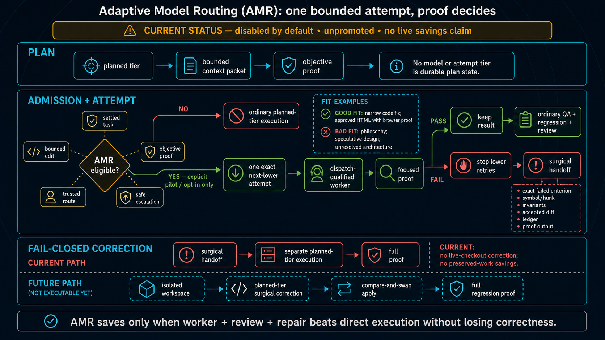

# KB Workflow Skills

Portable workflow skills that make coding agents easier to route, resume, and
verify across GitHub Copilot and Codex.

**Status:** actively used, pre-1.0. Expect interface changes while the workflow,
release tooling, and optional model-routing surfaces settle.

KB is for developers who want an agent to do more than generate plausible code.
It gives the agent a file-native operating model for recovering context,
choosing proportional ceremony, executing bounded work, proving behavior, and
delivering without calling unfinished work done.

Most users only install the Markdown skills. You do not need Go, the eval
harness, the private marketplace, or a background service to use KB in another
repository.

## Start Here

Install the core runtime for Codex, GitHub Copilot, and shared agent hosts:

```shell
npx github:Irtechie/working-skill-repo --target all --profile core
```

Then open a target project in a supported agent and invoke:

```text
kb-start "what I want done"
```

`kb-start` is an agent skill, not a standalone shell command. The installer
uses Node once to copy the bundle; Node is not required afterward.

For a repository-local install:

```shell
npx github:Irtechie/working-skill-repo \
  --target repo \
  --repo <path-to-your-project> \
  --profile core
```

Use the `full` profile when you also want every specialist reviewer:

```shell
npx github:Irtechie/working-skill-repo --target all --profile full
```

The installer detects changed copies, prompts before replacement, and writes
backups before an authorized overwrite. Optional managed binaries are installed
only when matching checksum-verified release assets exist; otherwise the normal
skill-only install still succeeds.

## The Six-Skill Loop

| Skill | Responsibility |
|---|---|
| `kb-start` | Route the request to the smallest workflow that can finish it safely |
| `kb-map` | Build or read repo-local memory for fresh-session recovery |
| `kb-fix` | Handle narrow bugs and contained edits |
| `kb-plan` | Turn clear requirements into verifiable vertical slices |
| `kb-work` | Execute dependency-ready slices and prove the integrated result |
| `kb-complete` | Resume any phase and carry reviewed work to its configured endpoint |

Everything else adds depth around that loop: brainstorming, research, durable
goals, functional testing, review, repair, delivery, learning, and maintenance.
The core path remains single-agent-first. Specialist review and multi-agent
execution are loaded only when the task warrants them.

KB means **Kanban-Based**. Boards, manifests, vertical slices, and done archives
carry durable state, while the short `kb-` prefix remains comfortable for voice
input and repeated use.

## How the Workflow Fits Together


Every request starts by anchoring to the active repository:

```text
request
  -> kb-start
  -> kb-map
  -> smallest fitting lane
  -> deterministic proof
  -> review when required
  -> configured delivery
```

That route is deliberately not one giant mandatory pipeline.

- A direct question gets a direct answer.
- A typo or known narrow bug uses `kb-fix`.
- Unclear broken behavior uses `kb-troubleshoot`.
- Product ambiguity goes through `kb-brainstorm`.
- Clear multi-step work goes through `kb-plan` and `kb-work`.
- Large migrations or several workstreams use `kb-epic`.
- Long-lived objectives use `kb-goal`.
- A feature that should reach its configured endpoint uses `kb-complete`.

The result is less ceremony for small work and more explicit control where
guessing would create rework.

## One Concrete Example

Suppose you ask:

```text
kb-complete "Add CSV export to the invoice list, preserving the current filters"
```

The workflow can carry that request through:

1. **Map the project.** `kb-map` finds the invoice UI, API, existing tests,
   current work, and relevant architecture notes without crawling unrelated
   subsystems.
2. **Check the requirements.** The agent confirms what “current filters”
   includes, records safe assumptions, and asks only if a real product decision
   blocks implementation.
3. **Plan vertical behavior.** `kb-plan` may create one slice for filtered export
   and one for user-visible failure handling. Each slice names expected files,
   dependencies, risk, and executable proof.
4. **Execute ready work.** `kb-work` selects dependency-ready slices, prevents
   overlapping writes, and runs focused tests before one integrated proof wave.
5. **Review the final tree.** `kb-finalize` chooses at most one semantic review
   profile, resolves actionable findings, and reruns only invalidated proof.
6. **Deliver honestly.** `kb-complete` follows project policy: local completion,
   a review-ready pull request, or explicitly authorized integration.

The terminal answer points to real evidence. It does not ask the user to rerun
normal tests, and it does not treat an agent’s self-report as proof.

For solo-owner plan-to-accepted-PR delivery:

```text
p2d "Add CSV export to the invoice list"
```

`p2d` plans first, then invokes `w2d`. That invocation supplies merge intent,
but never bypasses permissions, branch protection, required checks, or required
reviews.

## Task Routing



`kb-start` calls `kb-map` first, then chooses by task shape:

| Request signal | Route | Exit evidence |
|---|---|---|
| Missing or stale project memory | `kb-map` | Project-local route map |
| Direct explanation or tradeoff | Direct answer | No work gate |
| Known narrow defect | `kb-fix` | Focused reproduction and proof |
| Unclear broken behavior | `kb-troubleshoot` | Reproduction plus regression proof |
| Fuzzy product or technical intent | `kb-brainstorm` | Planning questions resolved |
| External behavior or prior art matters | `kb-research` | Cited research note |
| Clear feature or refactor | `kb-plan` | Valid manifest and slice plans |
| Existing manifest is runnable | `kb-work` | Slice and integrated proof |
| Large migration or many workstreams | `kb-epic` | Coordinated requirements and manifests |
| Durable objective across sessions | `kb-goal` | Goal ledger and terminal proof |
| Feature should reach its endpoint | `kb-complete` | Reviewed local, PR, or integrated state |

Routing is complexity-aware, not file-count-aware. The useful signals are
uncertainty, blast radius, coupling, reversibility, verification burden, and
product path dependency.

The user should not need to choose workflow ceremony. If the initial route
proves too small, the owning skill escalates with the evidence that changed the
classification.

## Planning and Execution

Planning uses vertical slices rather than horizontal implementation phases.
Each slice delivers one observable outcome across every required layer and
records:

- acceptance criteria and test scenarios;
- dependency edges and blockers;
- expected files as a forecast, not a write allowlist;
- risk, test level, execution class, and minimum capability tier;
- proof commands and protected oracles;
- escalation triggers for decisions the executor must not guess;
- the cheaper implementation option that was considered and rejected.

The manifest is a dependency graph. Independent ready slices may run in
parallel only when their writes and shared resources are isolated. Migrations,
destructive changes, browser sessions, and overlapping paths serialize.

`kb-work` keeps one owner per slice and one integration path per manifest. It
does not create a branch per file or let several workers edit the same checkout.
Slice-local proof runs after a slice stabilizes; broader integration proof runs
once at a coherent batch boundary.

## Model Routing with DDR


Plans record a portable minimum tier—small, medium, or large—rather than a
provider or model name. Immediately before execution, the orchestrator inspects
the routes that are actually callable in the current host.

The responsibilities stay separate:

1. **Planning sets minimum capability.** Difficulty, risk, tools, context, and
   proof determine the tier.
2. **The orchestrator chooses one owner.** It retains execution only for a
   recognized reason such as required context, authority, tools, trust, or no
   qualified route; otherwise it delegates once.
3. **The runtime records attribution.** A route receipt says what ran.
4. **Deterministic proof accepts the work.** A model tier or receipt never makes
   an implementation correct.

Optional `kbrouter` state can add user-local OpenAI-compatible or LiteLLM
routes. Endpoints, credentials, approvals, and source preferences stay outside
durable project plans. Generic MCP model dispatch is not claimed.

DDR is the normal production routing contract and is covered by deterministic
tests. It never routes below the planned tier or silently changes execution
owners. A fresh bounded local-route evaluation remains future evidence, not a
prerequisite for ordinary use.

## Project Mapping, Memory, and Handoffs


KB stores recoverable state in project files rather than requiring one endless
chat:

| Path | Purpose |
|---|---|
| `todo.md` | Active work, blockers, parked items, and handoff pointers |
| `todo-done.md` | Compact completed-work summaries |
| `docs/context/PROJECT.md` | Fresh-session route map |
| `docs/context/eval-map.md` | Repository-native proof surfaces |
| `docs/context/architecture/` | Durable subsystem boundaries and entry points |
| `docs/context/operations/` | Build, test, deploy, and QA commands |
| `docs/handoffs/` | Active, parked, and completed restart packets |

`kb-map` resolves the Git root before reading memory. It does not search a home
directory, sibling repository, or unrelated global handoff as a fallback.

When standard memory is missing, `kb-map-bootstrap` performs the expensive
first pass. Normal sessions then read narrow pointers instead of rebuilding the
whole map.

Handoffs are restart packets, not automatically executable plans. A new session
returns through `kb-start` and `kb-map`, classifies the handoff, and resumes the
correct owning lane.

Consuming projects decide whether durable memory belongs in Git. This bundle’s
own maintenance todos, plans, handoffs, results, goals, and generated views are
local and ignored so the public source tree remains product-focused.

## Verification Without Theater

Tests are mandatory, but KB avoids replaying the same full suite at every phase.

1. **Slice-local proof** runs the narrowest check that can fail for the changed
   behavior.
2. **Proof-batch aggregate** runs affected integration, functional, smoke, and
   regression checks once for a coherent group.
3. **Final exact-tree proof** runs after review fixes on the exact tree that may
   ship.

Receipts can be reused when command semantics, relevant inputs, environment,
and tree identity are unchanged. Code, dependencies, test configuration,
generated contracts, or conflict resolution invalidate only affected proof.

Frontend behavior requires rendered browser verification with real navigation,
interaction, and DOM assertions. Screenshots support that evidence but do not
replace assertions.

Security, auth, destructive data, public contracts, and live/deploy boundaries
still receive immediate targeted checks.

## Review, Delivery, and Recovery

Integrated work receives zero or one semantic review profile:

- the broad profile covers intent, test validity, correctness, and code health;
- security, migration, performance, reliability, API, CLI, or structural risk
  may select one specialist instead;
- profiles replace one another rather than stacking into a reviewer swarm.

P0 and P1 findings block completion until resolved. Cheap, clearly correct P2
and P3 fixes are handled by the agent; subjective or authority-bound decisions
remain visible for a human.

Delivery ownership is explicit:

- `kb-ship` commits, pushes a non-default topic branch, and creates or updates a
  correctly based pull request.
- `kb-land` is the only lane that integrates the remote default branch.
- neither uses force push, admin bypass, hook bypass, or protection bypass.
- local completion remains available when a project should not publish.

Blockers are responsibility-first. Test, code, controller, browser, and
reproducibility failures stay agent-owned while safe repair remains.
`human-required` is reserved for authority, credentials, private input,
irreversible risk, or subjective judgment.

## What Makes KB Different

- **Proportional routing.** Small tasks do not pay for a heavyweight pipeline.
- **Fresh-session recovery.** Durable memory replaces dependence on old chat.
- **Vertical plans.** Slices describe user-visible outcomes and their proof.
- **Code-owned control.** Ready sets, cycles, leases, gates, and receipt checks
  are deterministic where predictable behavior matters.
- **Bounded model judgment.** Models interpret and implement inside explicit
  scopes; code owns mechanical acceptance.
- **One useful review boundary.** Review happens on the integrated candidate,
  not as a swarm after every edit.
- **Honest delivery.** Local completion, an open PR, and merged default are
  distinct states.
- **Optional infrastructure.** File-native operation remains the baseline;
  routers, graph providers, and live evals are adapters rather than
  prerequisites.

The workflow uses explicit dependency graphs, but the graph chronology and
prior-art discussion belong in the linked
[research note](docs/context/research/2026-07-29-graph-engineering-definition-and-provenance.md),
not in the product introduction.

## What Is in This Repository

| Surface | Purpose |
|---|---|
| `.github/skills/` | 48 portable skills and lazy references |
| `.github/agents/` | Optional specialist review and execution profiles |
| `.github/instructions/` | Path-specific Copilot guidance |
| `bin/` | Cross-runtime installer and package tests |
| `cmd/`, `internal/` | Go verification, routing, reconciliation, and deterministic tooling |
| `evals/` | Deterministic routing, quality, completion, and regression fixtures |
| `config/` | Release, marketplace, architecture, and eval contracts |
| `packages/` | Optional UniversalUI Skills catalog contribution |
| `docs/` | Curated architecture, operations, research, and diagrams |

The npm package is intentionally smaller than the source repository. It ships
the installer, skills, agents, instructions, `AGENTS.md`, README, and license.
It does not ship the Go maintainer harness, eval corpus, or repository-local
documentation.

## Maintainer Commands

Contributor-safe deterministic gate:

```shell
go run ./cmd/kbcheck core
```

Release and installed-copy drift gate:

```shell
go run ./cmd/kbcheck local-release
```

Installer and package checks:

```shell
npm test
npm pack --dry-run
```

Useful focused commands:

| Command | Purpose |
|---|---|
| `go run ./cmd/kbcheck skill-lint` | Validate skill structure |
| `go run ./cmd/kbcheck route-eval` | Validate route-complexity fixtures |
| `go run ./cmd/kbcheck manifest-contract --manifest <path>` | Validate plan and gate contracts |
| `go run ./cmd/kbcheck skill-sync-report` | Report required installed-copy drift |
| `go run ./cmd/kbcheck doctor` | Inspect installation health |
| `go run ./cmd/kbcheck provider-hygiene` | Reject required-provider drift |

The Go tooling is optional for skill users. It exists so maintainers can test
claims mechanically rather than trusting README prose.

## Platform and Security Reality

The skills are Markdown instructions. Installation is Node-based. The
maintainer gate is Go-native.

- Windows is the currently recorded machine-verification platform.
- Unix-specific Go files cover Linux and macOS, but those paths do not yet have
  equivalent recorded machine proof.
- There is no hosted CI by design; `kbcheck` is the local release authority.
- Live model evals are explicit and may call authenticated local CLIs only when
  deliberately invoked.
- The npx installer does not require Go.

The private marketplace is an approval boundary, not a global install source.
Imported skills enter quarantine first. Promotion requires evidence, review,
hash pinning, and human approval. Active skill roots must never resolve into
quarantine.

Optional context providers must retain a file-native fallback. The bundle does
not require MCP search, a vector database, a daemon, or a Phoenix runtime.

## Read More

- [Documentation map](docs/README.md)
- [Skill catalog and responsibilities](docs/context/architecture/skills.md)
- [Workflow architecture](docs/context/architecture/kb-workflow.md)
- [Testing and release proof](docs/context/operations/testing.md)
- [Eval surface](docs/context/eval-map.md)
- [Skill bundle maintenance](docs/context/operations/skill-bundle-maintenance.md)
- [Private marketplace boundary](docs/context/architecture/private-skill-marketplace.md)
- [Learning model](docs/context/architecture/kb-learning-model.md)
- [Graph terminology and provenance research](docs/context/research/2026-07-29-graph-engineering-definition-and-provenance.md)

## Credits

KB grew from the All-The-Vibes StarterKit and Compound Engineering workflow.
It also adapts ideas from:

- [Matt Pocock's skills](https://github.com/mattpocock/skills) for vertical-slice
  decomposition;
- [G-Stack](https://github.com/garrytan/gstack) for persistent workflow memory
  and QA ownership;
- [ATV-Phoenix](https://github.com/All-The-Vibes/ATV-Phoenix) for failure-first
  proof and recovery mechanics;
- [HumanLayer](https://www.humanlayer.dev/blog/advanced-context-engineering) for
  concentrating human review on high-leverage decisions;
- [Plannotator](https://github.com/plannotator/dev-skills) for plain-language
  collaboration;
- [TokenMasterX](https://github.com/shyamsridhar123/TokenMasterX) for
  graph-aware repository orientation.

The [research index](docs/context/research/README.md) separates prior art,
experiments, and current implementation claims.

MIT licensed.
