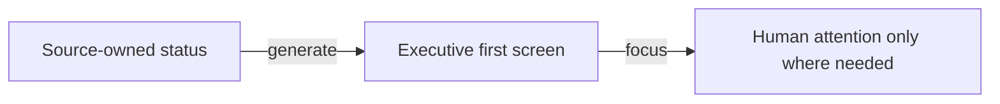

# Low-cognitive-burden communication

> **Response required: No.**

## Outcome

The core communication and review-artifact contracts are implemented, verified, and synchronized.

## What matters now

1. Questions distinguish hard human decisions, soft preferences, and information that needs no response.
2. Pull requests lead with outcome and genuine reviewer attention.
3. Visuals are generated only when relationships are easier to see than read.

## Flow

## Handled by agent

- Reconciled the plan-worktree and proof-governor skill drift.
- Synchronized required Codex, Copilot, and shared-agent copies.

## Verification

- go run ./cmd/kbcheck core
- go run ./cmd/kbcheck local-release
- go run ./cmd/kbcheck skill-sync-report

## Risks / later

- Generated visuals remain summaries; source-owned plans, results, and proof stay authoritative.

## Details

Source: docs/context/operations/low-burden-review-artifacts.md
