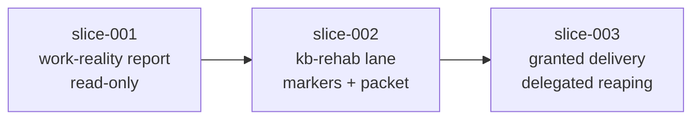

# kb-rehab: Outstanding Work Reconciliation

## Objective

Pair every piece of *declared* work in this repository against *git reality*,
classify each pairing with containment-proven evidence, deliver what is
provably complete, mark what is provably dead or superseded, and hand back a
bounded packet for everything that is genuinely ambiguous.

`kbreconcile` already owns artifact residue: worktrees, sessions, refs,
receipts, and queue claims. `todo-triage` already owns declared-work
classification but is git-blind. Nothing pairs the two. That pairing is the
whole product.

## Non-Goals

- Rebuilding inventory, ref deletion, or worktree reaping. Slice 003 delegates
  to `kbreconcile apply`.
- Forking the triage decision vocabulary. Slice 002 inherits `todo-triage`.
- Any post-merge sync to global install roots. R14a forbids it under a grant;
  it stays an explicit, separate human authorization.
- Touching ATV or any sibling checkout.

## Authority Posture

The user granted maximum runtime autonomy on 2026-08-26: auto-merge and
auto-delete anything proving terminal, ask only on genuine ambiguity. That
grant is bound to deterministic proof, not to confidence.

The grant governs what `kb-rehab` may do **when it runs**. A separate explicit
grant on 2026-08-26T18:02, scoped to this manifest only, authorizes local
commits for the work that builds it. Publishing, PR creation, merging, and
post-merge sync remain unauthorized and stay separate human decisions.

## Blast Radius

Merging to `main` in this repository syncs `.github/skills/**` into
`~/.codex/skills/`, `~/.copilot/skills/`, and `~/.agents/skills/`. That is a
supply-chain write into every future agent session on this host, not a
repo-local change. R14b therefore makes any pairing touching `.github/skills`,
`.github/agents`, `.github/instructions`, `cmd`, `internal`, `scripts`, or
`config/skill-quality.json` auto-merge-ineligible; those stop at PR for human
review regardless of the grant.

## Slice Sequence

The graph is deliberately linear. Slice 002 cannot classify without slice 001's
evidence, and slice 003 must not delete or merge without slice 002's
containment-proven classification.
